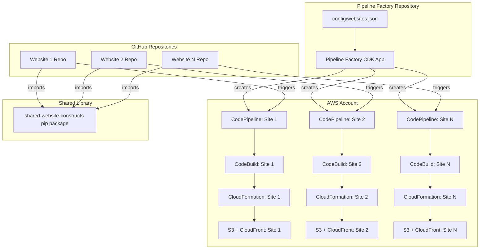
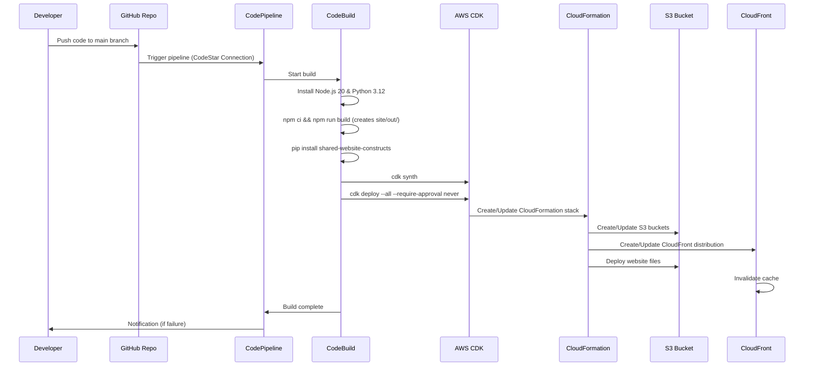

# Design Document: AWS Multi-Website CI/CD Pipeline Factory

## Overview

This design specifies the technical architecture for transforming a single-website AWS CDK deployment into a scalable multi-website CI/CD system. The solution follows the AWS-recommended "Pipeline Factory + Shared Construct Library" pattern to manage 10+ websites using AWS-native CI/CD tools.

### System Architecture

The system consists of three independent projects that work together:

1. **shared-website-constructs**: A reusable Python pip package containing the `WebsiteStack` CDK construct
2. **pipeline-factory**: A CDK application that generates CodePipeline stacks from JSON configuration
3. **website-template**: A minimal repository template that each website follows

### High-Level Architecture



### Deployment Flow



## Architecture

### Project 1: shared-website-constructs

A reusable Python pip package that encapsulates the website infrastructure pattern.

#### Package Structure

```
shared-website-constructs/
├── shared_website_constructs/
│   ├── __init__.py
│   ├── website_stack.py
│   └── version.py
├── tests/
│   ├── __init__.py
│   ├── test_website_stack_with_domain.py
│   ├── test_website_stack_without_domain.py
│   ├── test_website_stack_with_menu.py
│   └── test_website_stack_without_menu.py
├── setup.py
├── README.md
├── requirements.txt
└── requirements-dev.txt
```

#### Design Rationale

The shared construct library extracts the infrastructure pattern from the current `infra_stack.py` and makes it reusable. By parameterizing domain configuration and menu PDF bucket creation, a single construct can handle multiple deployment scenarios without code duplication.

### Project 2: pipeline-factory

A CDK application that reads JSON configuration and creates CodePipeline stacks.

#### Package Structure

```
pipeline-factory/
├── pipeline_factory/
│   ├── __init__.py
│   ├── app.py
│   ├── pipeline_stack.py
│   └── config_loader.py
├── config/
│   ├── websites.json
│   └── websites.schema.json
├── tests/
│   ├── __init__.py
│   ├── test_pipeline_stack.py
│   ├── test_config_loader.py
│   └── fixtures/
│       └── test_websites.json
├── cdk.json
├── README.md
├── requirements.txt
└── requirements-dev.txt
```

#### Design Rationale

The pipeline factory separates pipeline configuration from pipeline creation logic. By using a JSON configuration file, DevOps engineers can add new websites without modifying Python code. Each website gets its own isolated CodePipeline stack, enabling independent deployments and failure isolation.

### Project 3: website-template

A minimal repository template that each website follows.

#### Package Structure

```
website-template/
├── site/
│   ├── out/
│   │   └── index.html
│   ├── package.json
│   └── next.config.js
├── infra/
│   ├── app.py
│   ├── cdk.json
│   ├── buildspec.yml
│   └── requirements.txt
└── README.md
```

#### Design Rationale

The template provides a standardized structure that works with the pipeline factory. By reading configuration from environment variables (set by CodeBuild), the template requires no code changes when adding new websites. The `site/out/` directory convention matches Next.js static export patterns.

## Components and Interfaces

### Component 1: WebsiteStack Construct

**Location**: `shared-website-constructs/shared_website_constructs/website_stack.py`

**Purpose**: Reusable CDK construct that creates S3, CloudFront, and optional Route 53/ACM resources for a single website.

#### Class Definition

```python
from aws_cdk import Stack
from constructs import Construct
from typing import Optional

class WebsiteStack(Stack):
    """
    CDK Stack for deploying a static website with S3 and CloudFront.
    
    Supports:
    - Custom domains with Route 53 and ACM (optional)
    - CloudFront OAI for S3 access
    - SPA error handling (403/404 -> index.html)
    - Optional separate public bucket for PDF files
    """
    
    def __init__(
        self,
        scope: Construct,
        construct_id: str,
        *,
        site_name: str,
        domain_name: Optional[str] = None,
        hosted_zone_id: Optional[str] = None,
        hosted_zone_name: Optional[str] = None,
        content_path: str = "./site/out",
        error_page_path: str = "/index.html",
        menu_pdf_enabled: bool = False,
        menu_pdf_bucket_name: Optional[str] = None,
        menu_pdf_path: Optional[str] = None,
        menu_pdf_filename: Optional[str] = None,
        **kwargs
    ) -> None:
        """
        Initialize WebsiteStack.
        
        Args:
            site_name: Unique identifier for the website (used in resource names)
            domain_name: Custom domain (e.g., "example.com"). If None, uses CloudFront default domain
            hosted_zone_id: Route 53 hosted zone ID (required if domain_name provided)
            hosted_zone_name: Route 53 hosted zone name (required if domain_name provided)
            content_path: Path to website files (default: "./site/out")
            error_page_path: SPA error page path (default: "/index.html")
            menu_pdf_enabled: Whether to create separate public PDF bucket (default: False)
            menu_pdf_bucket_name: Name for PDF bucket (optional)
            menu_pdf_path: Path to PDF files (required if menu_pdf_enabled=True)
            menu_pdf_filename: PDF filename to deploy (required if menu_pdf_enabled=True)
        """
```

#### Public Attributes

```python
@property
def website_bucket(self) -> s3.Bucket:
    """The S3 bucket containing website files."""

@property
def distribution(self) -> cloudfront.Distribution:
    """The CloudFront distribution."""

@property
def menu_bucket(self) -> Optional[s3.Bucket]:
    """The menu PDF S3 bucket (None if menu_pdf_enabled=False)."""

@property
def website_url(self) -> str:
    """The website URL (custom domain or CloudFront default)."""
```

#### Internal Methods

```python
def _create_website_bucket(self) -> s3.Bucket:
    """Create private S3 bucket for website content."""

def _create_oai(self) -> cloudfront.OriginAccessIdentity:
    """Create CloudFront Origin Access Identity."""

def _create_certificate(self) -> Optional[acm.Certificate]:
    """Create ACM certificate if domain_name provided."""

def _create_distribution(self) -> cloudfront.Distribution:
    """Create CloudFront distribution with OAI and error handling."""

def _deploy_website_content(self) -> s3deploy.BucketDeployment:
    """Deploy website files from content_path to S3."""

def _create_menu_bucket(self) -> Optional[s3.Bucket]:
    """Create public S3 bucket for PDF files if menu_pdf_enabled=True."""

def _deploy_menu_pdf(self) -> Optional[s3deploy.BucketDeployment]:
    """Deploy PDF file to menu bucket if menu_pdf_enabled=True."""

def _create_route53_record(self) -> Optional[route53.ARecord]:
    """Create Route 53 A-record if domain_name provided."""

def _create_outputs(self) -> None:
    """Create CloudFormation outputs."""
```

#### Resource Creation Logic

The construct creates resources in this order:

1. **Website S3 Bucket**: Private bucket with `BLOCK_ALL` public access
2. **CloudFront OAI**: Origin Access Identity for S3 access
3. **ACM Certificate** (conditional): Only if `domain_name` is provided and not empty
4. **CloudFront Distribution**: With OAI, HTTPS redirect, and SPA error handling
5. **S3 BucketDeployment**: Uploads files from `content_path` with CloudFront invalidation
6. **Menu PDF Bucket** (conditional): Only if `menu_pdf_enabled=True`
7. **Menu PDF Deployment** (conditional): Only if `menu_pdf_enabled=True` and paths provided
8. **Route 53 A-Record** (conditional): Only if `domain_name` provided
9. **CloudFormation Outputs**: URLs, IDs, and bucket names

#### Conditional Logic

**Domain Configuration**:
- If `domain_name` is `None` or empty string: Skip ACM, Route 53, and CloudFront domain configuration
- If `domain_name` is provided: Require `hosted_zone_id` and `hosted_zone_name`, create all domain resources

**Menu PDF Bucket**:
- If `menu_pdf_enabled=False`: Skip menu bucket and deployment entirely
- If `menu_pdf_enabled=True`: Create public bucket, require `menu_pdf_path` and `menu_pdf_filename` for deployment

### Component 2: Pipeline Stack

**Location**: `pipeline-factory/pipeline_factory/pipeline_stack.py`

**Purpose**: Creates a CodePipeline with Source (GitHub) and Build (CodeBuild) stages for a single website.

#### Class Definition

```python
from aws_cdk import Stack
from constructs import Construct
from typing import Dict

class PipelineStack(Stack):
    """
    CDK Stack that creates a CodePipeline for a single website.
    
    The pipeline:
    - Triggers on GitHub push to main branch
    - Runs CodeBuild to build Next.js site and deploy CDK
    - Sends SNS notifications on failure
    """
    
    def __init__(
        self,
        scope: Construct,
        construct_id: str,
        *,
        site_name: str,
        github_owner: str,
        github_repo: str,
        connection_arn: str,
        notification_email: str,
        build_environment_variables: Dict[str, str],
        **kwargs
    ) -> None:
        """
        Initialize PipelineStack.
        
        Args:
            site_name: Unique identifier for the website
            github_owner: GitHub organization or user
            github_repo: GitHub repository name
            connection_arn: CodeStar Connection ARN for GitHub
            notification_email: Email for failure notifications
            build_environment_variables: Environment variables for CodeBuild
        """
```

#### Internal Methods

```python
def _create_source_artifact(self) -> codepipeline.Artifact:
    """Create artifact for source code."""

def _create_source_action(self) -> codepipeline_actions.CodeStarConnectionsSourceAction:
    """Create GitHub source action using CodeStar Connection."""

def _create_codebuild_project(self) -> codebuild.PipelineProject:
    """Create CodeBuild project with Python 3.12 runtime and required IAM permissions."""

def _create_build_action(self) -> codepipeline_actions.CodeBuildAction:
    """Create CodeBuild action for pipeline."""

def _create_pipeline(self) -> codepipeline.Pipeline:
    """Create CodePipeline V2 with Source and Build stages."""

def _create_notification_topic(self) -> sns.Topic:
    """Create SNS topic for failure notifications."""

def _setup_failure_notifications(self) -> None:
    """Configure pipeline to send SNS notifications on failure."""
```

#### CodeBuild IAM Permissions

The CodeBuild project requires these IAM permissions:

```python
# CloudFormation
"cloudformation:*"

# S3
"s3:*"

# CloudFront
"cloudfront:*"

# Route 53
"route53:*"

# ACM
"acm:*"

# Lambda (for CDK custom resources)
"lambda:*"

# SSM (for CDK context)
"ssm:*"

# IAM (for CDK role creation)
"iam:PassRole"
"iam:CreateRole"
"iam:AttachRolePolicy"
"iam:PutRolePolicy"
"iam:DeleteRole"
"iam:DetachRolePolicy"
"iam:DeleteRolePolicy"
"iam:GetRole"
"iam:TagRole"
"iam:UntagRole"

# STS (for CDK bootstrap)
"sts:AssumeRole" on "arn:aws:iam::*:role/cdk-*"
```

### Component 3: Config Loader

**Location**: `pipeline-factory/pipeline_factory/config_loader.py`

**Purpose**: Loads and validates the `websites.json` configuration file.

#### Class Definition

```python
from typing import List, Dict, Any
from dataclasses import dataclass

@dataclass
class WebsiteConfig:
    """Configuration for a single website."""
    site_name: str
    github_repo: str
    domain_name: str  # Empty string means no domain
    hosted_zone_id: str  # Empty string means not configured
    hosted_zone_name: str  # Empty string means not configured
    menu_pdf_enabled: bool
    menu_pdf_bucket_name: str  # Empty string means not configured
    menu_pdf_filename: str  # Empty string means not configured

@dataclass
class PipelineFactoryConfig:
    """Complete configuration for pipeline factory."""
    connection_arn: str
    github_owner: str
    default_region: str
    default_account: str
    notification_email: str
    websites: List[WebsiteConfig]

class ConfigLoader:
    """Loads and validates pipeline factory configuration."""
    
    @staticmethod
    def load_from_file(file_path: str) -> PipelineFactoryConfig:
        """
        Load configuration from JSON file.
        
        Args:
            file_path: Path to websites.json
            
        Returns:
            Validated PipelineFactoryConfig
            
        Raises:
            ValueError: If configuration is invalid
        """
    
    @staticmethod
    def validate_config(config: PipelineFactoryConfig) -> None:
        """
        Validate configuration.
        
        Checks:
        - All site_name values are unique
        - All github_repo values are unique
        - Required fields are not empty
        
        Raises:
            ValueError: If validation fails
        """
```

### Component 4: Website Template App

**Location**: `website-template/infra/app.py`

**Purpose**: CDK app that reads environment variables and instantiates WebsiteStack.

#### Implementation

```python
#!/usr/bin/env python3
import os
from aws_cdk import App, Environment
from shared_website_constructs import WebsiteStack

app = App()

# Read environment variables (set by CodeBuild)
site_name = os.environ.get("SITE_NAME", "")
domain_name = os.environ.get("DOMAIN_NAME", "")
hosted_zone_id = os.environ.get("HOSTED_ZONE_ID", "")
hosted_zone_name = os.environ.get("HOSTED_ZONE_NAME", "")
menu_pdf_enabled_str = os.environ.get("MENU_PDF_ENABLED", "false")
menu_pdf_bucket_name = os.environ.get("MENU_PDF_BUCKET_NAME", "")
menu_pdf_filename = os.environ.get("MENU_PDF_FILENAME", "")

# Convert string to boolean
menu_pdf_enabled = menu_pdf_enabled_str.lower() == "true"

# Determine if domain is configured
has_domain = domain_name and domain_name.strip() != ""

# Build WebsiteStack parameters
stack_params = {
    "site_name": site_name,
    "content_path": os.path.abspath(os.path.join(os.path.dirname(__file__), "..", "site", "out")),
    "menu_pdf_enabled": menu_pdf_enabled,
}

# Add domain parameters if configured
if has_domain:
    stack_params["domain_name"] = domain_name
    stack_params["hosted_zone_id"] = hosted_zone_id
    stack_params["hosted_zone_name"] = hosted_zone_name

# Add menu PDF parameters if enabled
if menu_pdf_enabled:
    stack_params["menu_pdf_bucket_name"] = menu_pdf_bucket_name if menu_pdf_bucket_name else None
    stack_params["menu_pdf_path"] = os.path.abspath(os.path.join(os.path.dirname(__file__)))
    stack_params["menu_pdf_filename"] = menu_pdf_filename

# Create stack
WebsiteStack(
    app,
    f"{site_name}-website",
    env=Environment(
        account=os.environ.get("CDK_DEFAULT_ACCOUNT"),
        region=os.environ.get("CDK_DEFAULT_REGION", "us-east-1"),
    ),
    **stack_params
)

app.synth()
```

## Data Models

### websites.json Schema

**Location**: `pipeline-factory/config/websites.json`

```json
{
  "connectionArn": "arn:aws:codestar-connections:us-east-1:123456789012:connection/abc-123",
  "githubOwner": "my-org",
  "defaultRegion": "us-east-1",
  "defaultAccount": "123456789012",
  "notificationEmail": "devops@example.com",
  "websites": [
    {
      "siteName": "site1",
      "githubRepo": "site1-repo",
      "domainName": "site1.example.com",
      "hostedZoneId": "Z1234567890ABC",
      "hostedZoneName": "example.com",
      "menuPdfEnabled": true,
      "menuPdfBucketName": "site1-menu-files",
      "menuPdfFilename": "menu.pdf"
    },
    {
      "siteName": "site2",
      "githubRepo": "site2-repo",
      "domainName": "",
      "hostedZoneId": "",
      "hostedZoneName": "",
      "menuPdfEnabled": false,
      "menuPdfBucketName": "",
      "menuPdfFilename": ""
    }
  ]
}
```

#### Field Definitions

**Top-Level Fields**:
- `connectionArn` (string, required): CodeStar Connection ARN for GitHub integration
- `githubOwner` (string, required): GitHub organization or user name
- `defaultRegion` (string, required): AWS region for deployments (e.g., "us-east-1")
- `defaultAccount` (string, required): AWS account ID
- `notificationEmail` (string, required): Email address for pipeline failure notifications
- `websites` (array, required): List of website configurations

**Website Object Fields**:
- `siteName` (string, required): Unique identifier for the website (used in stack names and resource IDs)
- `githubRepo` (string, required): GitHub repository name (without owner prefix)
- `domainName` (string, required): Custom domain name or empty string for no domain
- `hostedZoneId` (string, required): Route 53 hosted zone ID or empty string
- `hostedZoneName` (string, required): Route 53 hosted zone name or empty string
- `menuPdfEnabled` (boolean, required): Whether to create menu PDF bucket
- `menuPdfBucketName` (string, required): S3 bucket name for PDFs or empty string
- `menuPdfFilename` (string, required): PDF filename to deploy or empty string

#### Empty String Convention

Empty string (`""`) indicates "not configured" for optional fields. This allows the JSON schema to remain simple while supporting optional features.

**Interpretation**:
- `domainName: ""` → No custom domain, use CloudFront default
- `hostedZoneId: ""` → No Route 53 configuration
- `menuPdfBucketName: ""` → Auto-generate bucket name
- `menuPdfFilename: ""` → No PDF deployment

### JSON Schema Validation

**Location**: `pipeline-factory/config/websites.schema.json`

```json
{
  "$schema": "http://json-schema.org/draft-07/schema#",
  "type": "object",
  "required": ["connectionArn", "githubOwner", "defaultRegion", "defaultAccount", "notificationEmail", "websites"],
  "properties": {
    "connectionArn": {
      "type": "string",
      "pattern": "^arn:aws:codestar-connections:[a-z0-9-]+:[0-9]{12}:connection/[a-f0-9-]+$"
    },
    "githubOwner": {
      "type": "string",
      "minLength": 1
    },
    "defaultRegion": {
      "type": "string",
      "pattern": "^[a-z]{2}-[a-z]+-[0-9]$"
    },
    "defaultAccount": {
      "type": "string",
      "pattern": "^[0-9]{12}$"
    },
    "notificationEmail": {
      "type": "string",
      "format": "email"
    },
    "websites": {
      "type": "array",
      "minItems": 1,
      "items": {
        "type": "object",
        "required": ["siteName", "githubRepo", "domainName", "hostedZoneId", "hostedZoneName", "menuPdfEnabled", "menuPdfBucketName", "menuPdfFilename"],
        "properties": {
          "siteName": {
            "type": "string",
            "pattern": "^[a-z0-9-]+$",
            "minLength": 1
          },
          "githubRepo": {
            "type": "string",
            "minLength": 1
          },
          "domainName": {
            "type": "string"
          },
          "hostedZoneId": {
            "type": "string"
          },
          "hostedZoneName": {
            "type": "string"
          },
          "menuPdfEnabled": {
            "type": "boolean"
          },
          "menuPdfBucketName": {
            "type": "string"
          },
          "menuPdfFilename": {
            "type": "string"
          }
        }
      }
    }
  }
}
```

### buildspec.yml Structure

**Location**: `website-template/infra/buildspec.yml`

```yaml
version: 0.2

phases:
  install:
    runtime-versions:
      nodejs: 20
      python: 3.12
    commands:
      - echo "Installing dependencies..."
      
  pre_build:
    commands:
      - echo "Building Next.js site..."
      - cd site
      - npm ci
      - npm run build
      - cd ..
      - echo "Site built successfully"
      
  build:
    commands:
      - echo "Deploying infrastructure..."
      - cd infra
      - pip install -r requirements.txt
      - cdk synth
      - cdk deploy --all --require-approval never
      - cd ..
      
env:
  variables:
    CDK_DEFAULT_REGION: us-east-1
  exported-variables:
    - CDK_DEFAULT_ACCOUNT
    - CDK_DEFAULT_REGION
```

The `CDK_DEFAULT_ACCOUNT` is automatically available in CodeBuild from AWS context. The `CDK_DEFAULT_REGION` can be overridden by the pipeline factory if needed.

## Correctness Properties

